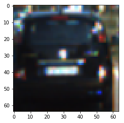
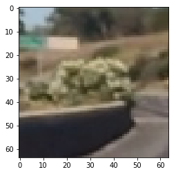
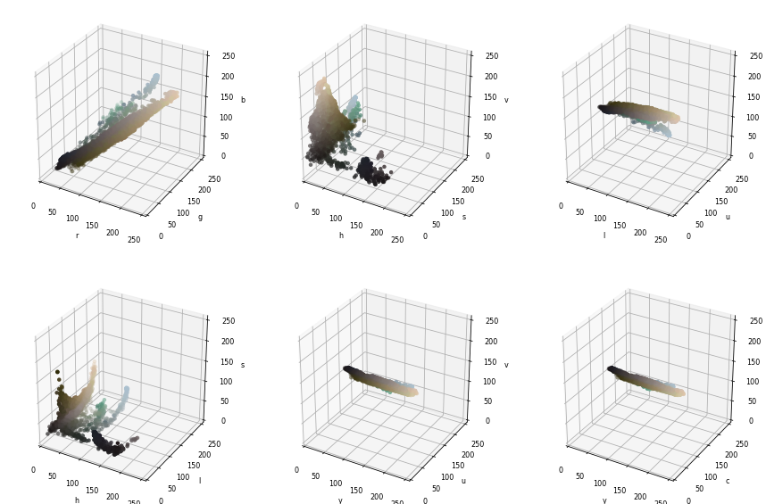
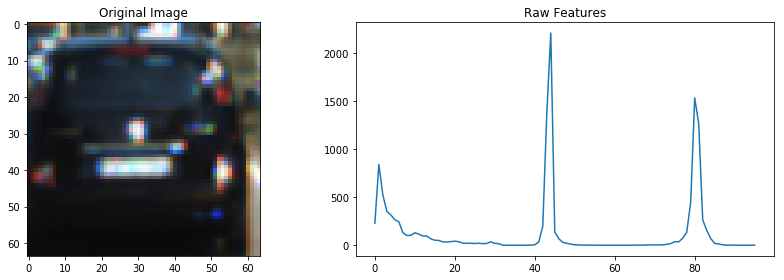
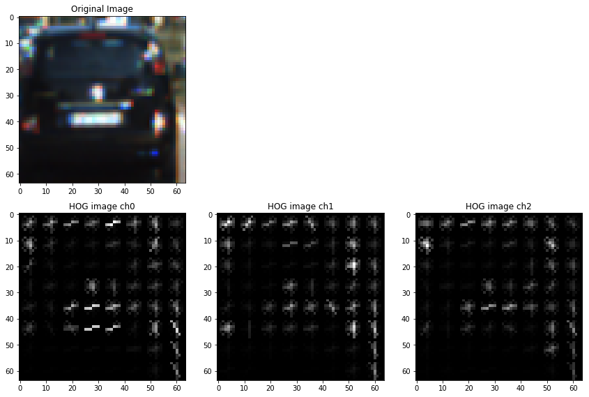

##Writeup

---

**Vehicle Detection Project**

The goals / steps of this project are the following:

* Perform a Histogram of Oriented Gradients (HOG) feature extraction on a labeled training set of images and train a classifier Linear SVM classifier
* Apply a color transform and append binned color features, as well as histograms of color, to the HOG feature vector.
* Normalize features and randomize a selection for training and testing.
* Implement a sliding-window technique and use trained classifier to search for vehicles in images.
* Run pipeline on a video streamand create a heat map of recurring detections frame by frame to reject outliers and follow detected vehicles.
* Estimate a bounding box for vehicles detected.

---
Please note: All of the code that is described here relies heavily on the example code from the Vehicle Detection Tutorial of the website.

##Feature Extraction

In order to train a classifier for the detection of cars from images a feature vector will be generated that contains meaningful information in order to separate "car" from "no car images". The following methods are applied to generate the feature vector:

* resize image to 64x64
* color histogram
* spatial color binning
* histogram of gradients

Each is described in the following.

####Resize image
This is done in order to have a fixed feature vector size with which the classifier can work. Images taken from a video stream for classification will also be scaled to this format.

####Color Histogram
For the generation of the color histogram an appropriate color space is selected. This is shown in the following images for a "car" and a "no car" image:

---

In the following the LUV-colorspace is selected as it appears to give a nice separation between cars and nocars. The color histogram feature vector is then generated by dividing each color channel into 32 bins and then counting how many pixel color values fall into each bin. The channel results are then concatenated (cell 5 of jupyter notebook). The histogram feature vector looks as follows:

####Spatial Color Binning
The color binning part of the feature vector is generated by taking the pixel color values (for each channel) and concatenating them (cell 6 of jupyter notebook). The result can be seen below:

####Histogram of Gradients (HOG)
For the HOG part of the feature vector I use the following parameterization:

* orientation bins: 9
* pixels per cell: 8x8
* cells per block: 2x2

This means that for each pixel a gradient madnitude and direction is computed. 8x8 pixel sections (cells) of the image are then evaluated and the gradient results are grouped according to their direction value in 9 bins (where their magnitudes are added up). This gives 9 values for each 8x8 pixel cell of the image. These 9 values are computed for each cell in a block and the blocks are shifted over the image horizontally and vertically with a one-cell step size. For a 64x64 image this then gives a feature vector size of 7x7x2x2x9=1764.

The result looks as follows:

As the "L" color channel already gives a good impression of the image shape, only this channel will be used in the image feature vector.

---

##Selection and Training of Classifier
In the following the classifier is trained. For this I am using the test images that are provided in the tutorial (the full set with 8792 car and 8968 nocar images). The images are transformed to LUV colorspace and the feature vector for each image is extracted with the methods described above. The feature vector is then normalized (cell 9 of jupyter notebook). The dataset is shuffled and split into training and test data (80% training data, 20% test data). Then a linear support vector classifier is trained with the training data (in cell 10 of the notebook). Validation with the test data set gives a prediction accuracy of 97.9%.

##Sliding Window Search
Next the classifier performance is tested with a set of test images. To detect cars in the test images a sliding window search is performed. For this, search windows are moved over the test image and the content at each search window position is analyzed with the classifier to assess if it contains a car. The size of the search window can be selected as well as the start and stop positions of the search (if a size other than 64x64 is selected the content of the search window has to be rescaled to this size for the classifier to work properly). The search window positions are set to an overlap of 50% in horizontal and vertical directions. I experimented with less overlap (mainly in order to speed up computation time) but found that the detection of cars in the images was less accurate. The function for the sliding window search is defined in cell 14 of the notebook and the classification takes place in cell 15.
The result of the search with a test image can be seen in the figure below (red boxes in lower right part of the image).

The image is searched with the following windows:

* size 64x64 in lower half of the image
* size 128x128 in lower half of the image

As can be seen with the red boxes the analysis of the image also delivers some false detections. Therefore the detection result is not plotted directly. Instead a so called heatmap is generated which means that an array with the size of the test image is generated that is initialized with zero at all array positions. In regions where a car is detected the array value is increased by 2; if no car is detected the value is decreased by 1. The heatmap value is bounded between 0 and 15. Only array positions greater then a certain threshold value are now actually considered as car detections. (All of this is defined in cell 17 of the notebook). The bounding boxes around the section of the heatmap are then found with the function "labels" from scipy.ndimage.measurements" and drawn with the function "draw_labeled_bboxes". The result can be seen in the left part of the image above

## Video Implementation
For the analysis of a video stream I applied the same approach as above - with slight modifications. I used the following search windows to analyze every 10th image:

* size: 64x64; x start position: 250; x stop position: 1000; y start position 350; y stop position 500
* size: 100x100; x start position: 250; x stop position: 1000; y start position 350; y stop position 500
* size: 64x64; x start position: 0; x stop position: 350; y start position 350; y stop position 720
* size: 100x100; x start position: 0; x stop position: 350; y start position 350; y stop position 720
* size: 64x64; x start position: 900; x stop position: 1280; y start position 350; y stop position 720
* size: 100x100; x start position: 900; x stop position: 1280; y start position 350; y stop position 720

This is done in order to detect new cars in the video stream (at positions where they are most likely to appear). To track the already detected cars in the other 9 images in between I compute the centers of the bounding boxes for the already detected cars and then search in only a region (+/-80pixels) around these bounding box centers. For this I also use search windows of sizes 64x64 and 100x100. This improves computation time (although the result still cannot be used in a realtime application :-(.
A sample video of the results can be found in the github repository.

---

###Discussion

* The classificator still detects quite a number of false positive results (especially in regions with lots of shadows (left side of track). Therefore I would like to make the classification more robust by using more of these "false positives" in the training of the classifier.
* The bounding boxes are still "jittery". Filtering the detection results should improve this behaviour.

